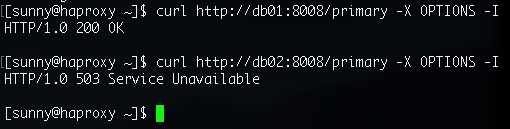
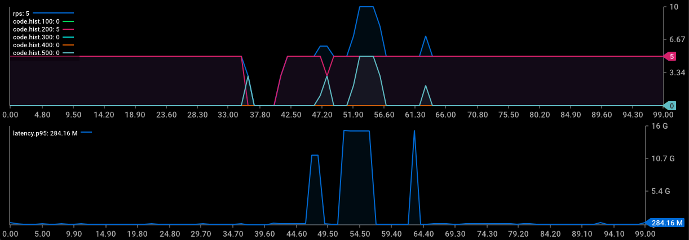
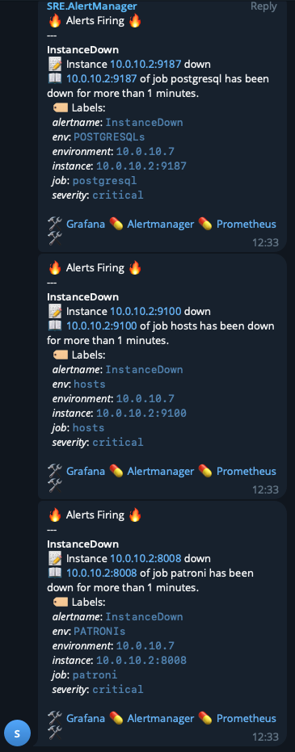
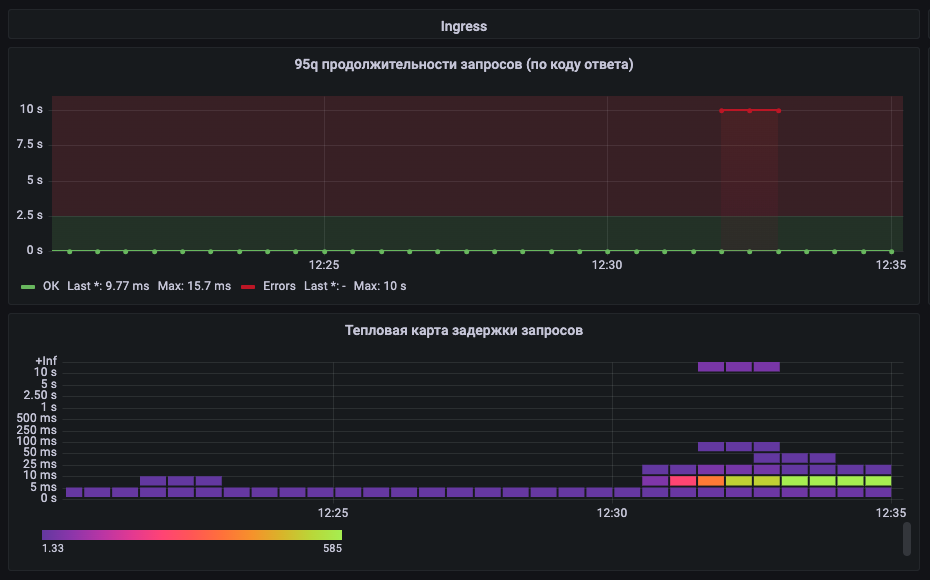
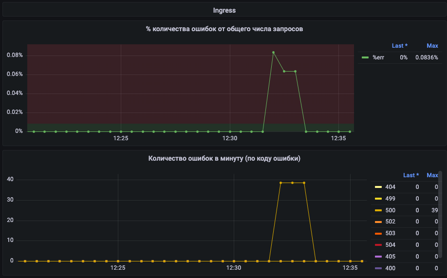
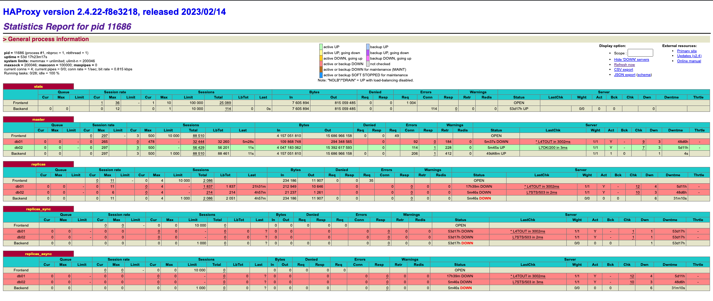
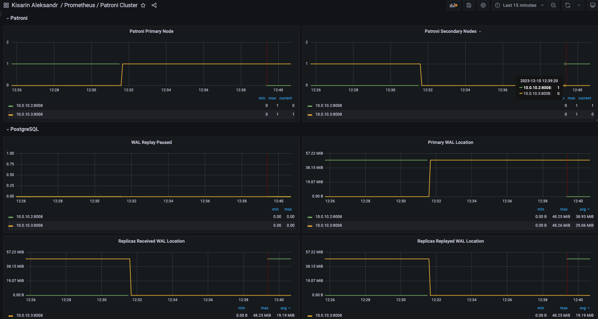
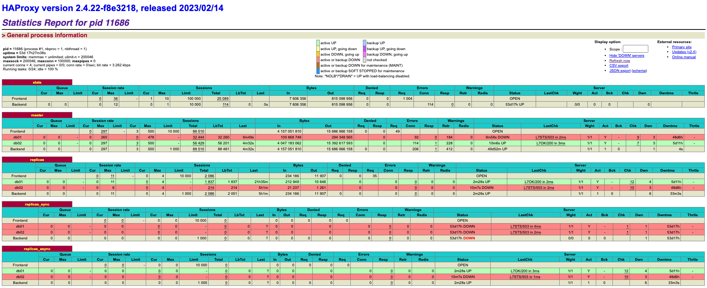
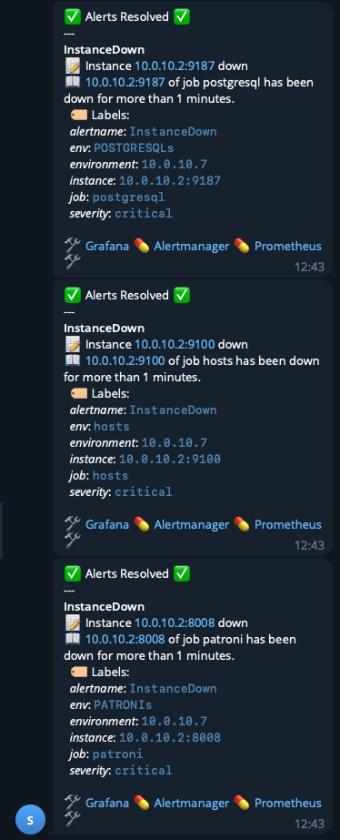

# Chaos engineering
## 1. Отключение узла
### 1.1. Описание эксперимента: 
- определим какой из узлов кластера является ведущим
- запустим запросы к тестируемому ресурсу для оценки времени восстановления
```bash
echo "GET http://91.185.85.213/WeatherForecast" | vegeta attack -duration=300s -rate=5 -header Host:web-api | vegeta encode | \
     jaggr @count=rps hist\[100,200,300,400,500\]:code p95:latency| \
     jplot rps+code.hist.100+code.hist.200+code.hist.300+code.hist.400+code.hist.500 latency.p95
```
- останавливаем этот узел с помощью команды shutdown (засекаем время начала эксперимента)
```bash
date; shutdown -P now
```
- во время проведения эксперимента следим за мониторингом, статистикой haproxy и приходящими оповещениями
- через 5 минут включаем узел и проверяем состояние кластера
### 1.2. Ожидаемые результаты: 
Patroni на узле кластера, который до начала эксперимента был ведомым, должен определить потрею ведущего узла (по данным с etcd) и произвести аварийное переключение роли оставшегося Postgres сервера с ведомого на ведущий. Пользователи не должны получить недоступность нашего ресурса более 30 секунд (patroni ttl=30) плюс время на опрос и перевыборы (±2 сек). После включения бывшей ведущей ноды она должна стать ведомой и реплицировать изменения.
### 1.3. Реальные результаты: 
- ведущим узлов кластере является `db01`:

- запросы запущены, после остановки сервера `db01` мы видим, что недоступность ресурса (ошибки 500 по доступу к кластеру базы данных) составляла порядка `29 секунд` (это самый неудачный из экспериментов, среднее время восстановления приблизительно 10 сек)


- система мониторинга и оповещения сработала штатно  




- статистика haproxy показала переключение на резервный узел и отсутствие ведомого:

- после включения `db01` стал ведомым


- пришло оповещение о разрешении алертов

### 1.4. Анализ результатов: 
По результатам проведенного эксперимента мы можем утверждать, что наш кластер и система мониторинга и оповещения отработли `штатно`. Поведение системы оказалось ожидаемым. Переключение на ведомый узел базы данных при потере ведущего было в пределах ожидаемого времени, после включения выключенного узла его подключение в кластер в роли ведомого прошло в штатном режиме.
## 2. Имитация частичной потери сети
### 2.1. Описание эксперимента: 
- 
### 2.2. Ожидаемые результаты: 
-
### 2.3. Реальные результаты: 
-
### 2.4. Анализ результатов: 
-

## 3. Высокая нагрузка на CPU или I/O
### 3.1. Описание эксперимента: 
- 
### 3.2. Ожидаемые результаты: 
-
### 3.3. Реальные результаты: 
-
### 3.4. Анализ результатов: 
-

## 4. Тестирование систем мониторинга и оповещения
### 4.1. Описание эксперимента: 
- 
### 4.2. Ожидаемые результаты: 
-
### 4.3. Реальные результаты: 
-
### 4.4. Анализ результатов: 
-
