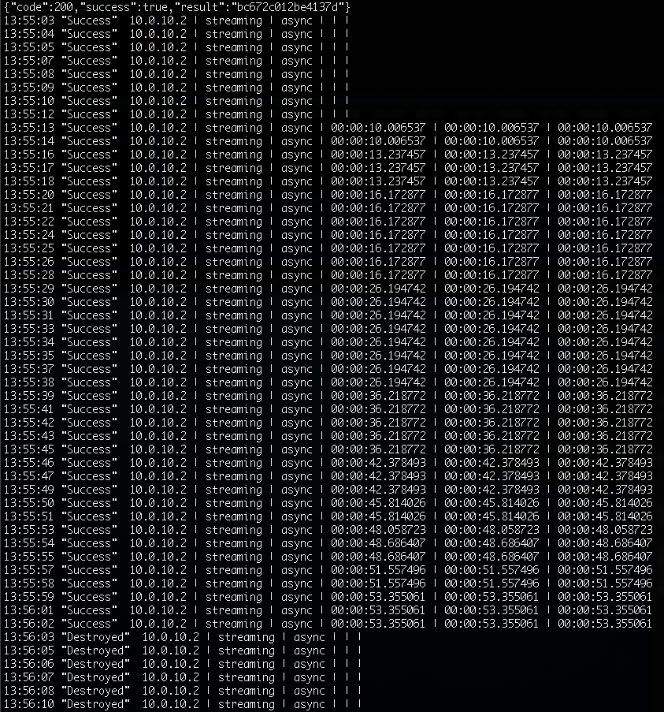
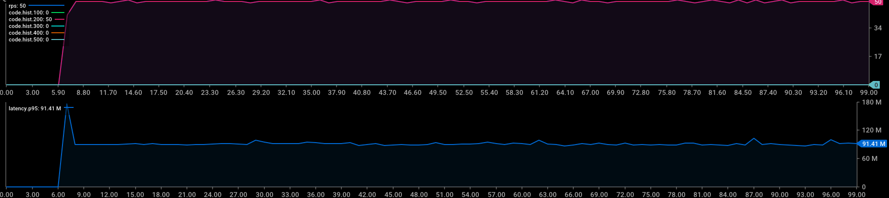
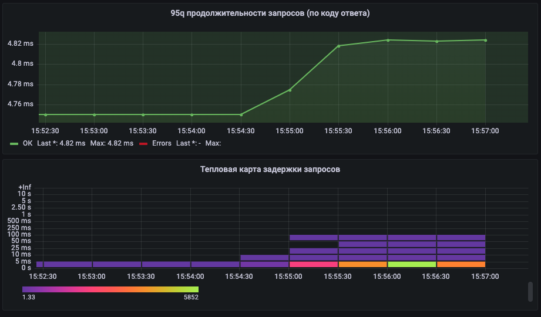
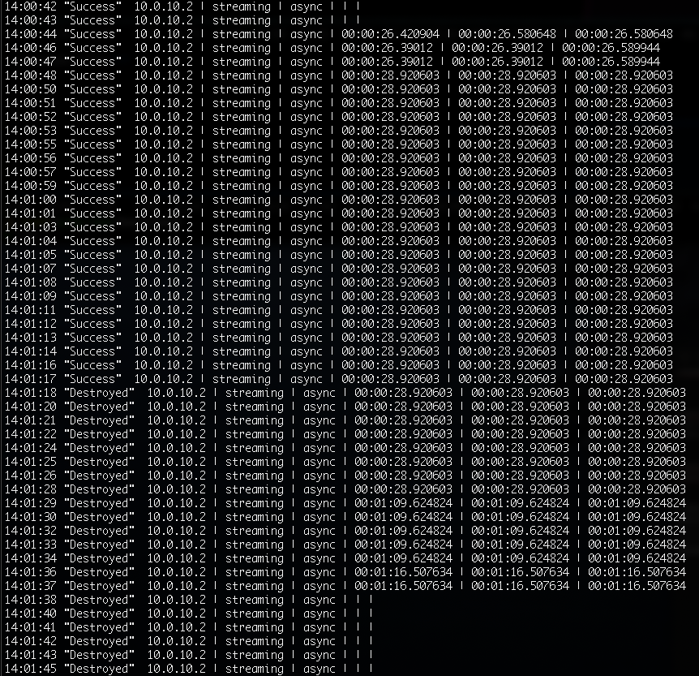
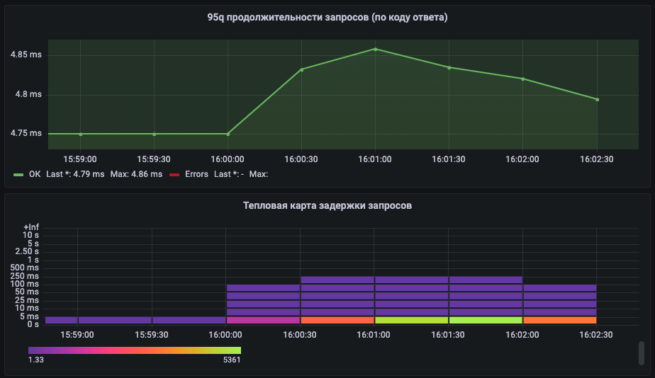

# Chaos engineering
## 1. Отключение узла
### 1.1. Описание эксперимента: 
- определим какой из узлов кластера является ведущим
- запустим запросы к тестируемому ресурсу для оценки времени восстановления
```bash
echo "GET http://91.185.85.213/WeatherForecast" | vegeta attack -duration=300s -rate=5 -header Host:web-api | vegeta encode | \
     jaggr @count=rps hist\[100,200,300,400,500\]:code p95:latency| \
     jplot rps+code.hist.100+code.hist.200+code.hist.300+code.hist.400+code.hist.500 latency.p95
```
- останавливаем этот узел с помощью команды shutdown (засекаем время начала эксперимента)
```bash
date; shutdown -P now
```
- во время проведения эксперимента следим за мониторингом, статистикой haproxy и приходящими оповещениями
- через 5 минут включаем узел и проверяем состояние кластера
### 1.2. Ожидаемые результаты: 
Patroni на узле кластера, который до начала эксперимента был ведомым, должен определить потрею ведущего узла (по данным с etcd) и произвести аварийное переключение роли оставшегося Postgres сервера с ведомого на ведущий. Пользователи не должны получить недоступность нашего ресурса более 30 секунд (patroni ttl=30) плюс время на опрос и перевыборы (±2 сек). После включения бывшей ведущей ноды она должна стать ведомой и реплицировать изменения.
### 1.3. Реальные результаты: 
- ведущим узлов кластере является `db01`:

- запросы запущены, после остановки сервера `db01` мы видим, что недоступность ресурса (ошибки 500 по доступу к кластеру базы данных) составляла порядка `29 секунд` (это самый неудачный из экспериментов, среднее время восстановления приблизительно 10 сек)


- система мониторинга и оповещения сработала штатно  


- статистика haproxy показала переключение на резервный узел и отсутствие ведомого:

- после включения `db01` стал ведомым


- пришло оповещение о разрешении алертов  


### 1.4. Анализ результатов: 
По результатам проведенного эксперимента мы можем утверждать, что наш кластер и система мониторинга и оповещения отработли `штатно`. Поведение системы оказалось ожидаемым. Переключение на ведомый узел базы данных при потере ведущего было в пределах ожидаемого времени, после включения выключенного узла его подключение в кластер в роли ведомого прошло в штатном режиме.
## 2. Имитация частичной потери сети
### 2.1. Описание эксперимента: 
- запустим запросы к тестируемому ресурсу для добавления записей в базу и для оценки влияния эксперимента на пользовательский опыт
```bash
vegeta attack -duration=200s -rate=50 -targets=targets.list | vegeta encode | \
    jaggr @count=rps hist\[100,200,300,400,500\]:code p95:latency| \
    jplot rps+code.hist.100+code.hist.200+code.hist.300+code.hist.400+code.hist.500 latency.p95
```
```targets.list:
POST http://91.185.85.213/Cities
Host: web-api
accept: text/plain
Content-Type: application/json
@body.json
```
- имитируем потерю 75% и 95% пакетов между узлами кластера командами (выполняем их на ведущем узле)
```bash
blade create network loss --percent 75 --destination-ip 10.0.10.2 --interface ens160 --timeout 60
blade create network loss --percent 95 --destination-ip 10.0.10.2 --interface ens160 --timeout 60
```
- смотрим наличие лага репликации в процессе выполнения эксперимента
```bash
while true; do echo `date +%H:%M:%S`\ `./blade status --type create --limit 1 | jq '.result[0].Status'`\ \
      `psql -U postgres -tc "select client_addr,state,sync_state,write_lag,flush_lag,replay_lag from  pg_stat_replication;"`; \
      sleep 1; \
done
```
- во время проведения эксперимента следим за мониторингом, статистикой haproxy и приходящими оповещениями
### 2.2. Ожидаемые результаты: 
Ожидается постепенное отставание реплики от мастера. После завершения имитации потери пакетов, репликация должна быстро восстановиться
Для пользователя никаких проблем в использовании ресурса возникнуть не должно. С увеличением числа потерь, ожидаем большее отставание и, как результат, более медленное восстановление репликации.
### 2.3. Реальные результаты: 
- при потери пакетов `75%` мы наблюдаем отставание репликации 53 сек. при восстановлении сети репликация быстро восстановилась:

- при этом заметного влияние на использование ресурса это не оказало:


- при потери пакетов `95%` мы наблюдали отставание в 1 мин 16 сек, но это является не точными данными, так как при таком уровне потерь и при выбранном методе замеров, на данные оказало влияние сбор статистики самим postgres (оно происходило с большим отставанием). восстановление было заметно более долгим - `порядка 20 сек против менее 1 сек при 75%`

- на использование ресурса потери между узлами кластера так же не оказали заметного влияния:

### 2.4. Анализ результатов:
Реальные результаты полностью совпали с ожидаемыми. При этом увеличение уровня потерь пакетов между узлами кластера значительно влияет на скорость восстановления репликации. Так же мы обнаружили, что при высоком уровне потерь, выбранный способ отслеживания репликации может давать сильно отстающие данные от реальных величин, но коссвенно, по скорости восстановления репликации, мы все-таки можем судить о степени влияния уровня потерь на репликацию между узлами кластера.
## 3. Высокая нагрузка на CPU или I/O
### 3.1. Описание эксперимента: 
- 
### 3.2. Ожидаемые результаты: 
-
### 3.3. Реальные результаты: 
-
### 3.4. Анализ результатов: 
-

## 4. Тестирование систем мониторинга и оповещения
### 4.1. Описание эксперимента: 
- 
### 4.2. Ожидаемые результаты: 
-
### 4.3. Реальные результаты: 
-
### 4.4. Анализ результатов: 
-
